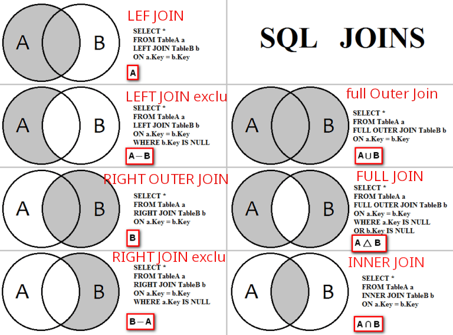

# basico-sql-oracle-mysql-maridb
conceptos, ejercicios basicas y avazadas de sql

## sql
lenguaje estructura de consulta.

## delete vs truncate
 delte elimina una fila, truncate todas las filas, este es mas rapido.
 
 ## MySQL
 Sistema de gestión de datos de código abierto.
 
 ## SQL Server
 Sistema de gestión de datos, del inglés Database Management System (DBMS).
 
 ## Oracle PL/SQL
 
 Lenguaje desarrollado por Oracle como extensión de SQL de ejecución de bloqueas de sentencias SQL.
 
 - No distingue entre letras mayúsculas o minúsculas
 - Permite estruturar rapidamente procedimientos
 
 ## ‘table’ - ‘field’
 
 - table (table): estrutura que organiza datos en filas y columnas
 - field: numero de columnas de una tabla
 
 
## join

Combinar o unir dos tablas distintas, une filas segun la columna relacionada que se defina. Basicos: inner, full, left, right.



## JOIN SQL -Oracle

- Tabla A (izquierda) y Tabla B (derecha).

### 1 left join (A)

segun una fila, une todas las coincidencias de la tabla izquierda con la derecha y la coincidencia entre ambas tablas. Se mostrarian todos los empleados con su id departamente y en null los que tienen un departamento que no existe.

```sql
 SELECT *
 FROM   empleado
        LEFT JOIN departamento
           ON empleado.IDDepartamento = departamento.IDDepartamento;
```

### 1 LEFT JOIN excluyendo la intersección(A-B)

segun una fila, une solamente las coincidencias de la tabla izquierda con la derecha , excluyendo los datos de la derecha. Todos los empleados con id departamento que no exsite (null).

```sql
 SELECT *
 FROM   empleado
        LEFT OUTER JOIN departamento
           ON empleado.IDDepartamento = departamento.IDDepartamento
 WHERE  departamento.IDDepartamento IS NULL;
```

### 2 RIGHT OUTER JOIN (B)

segun una fila, une todas las coincidencias de la tabla derecha con la izquierda y la coincidencia entre ambas tablas. Muestra los empleados que tienen empleados y los que no tienen empleados.

```sql
 SELECT *
 FROM   empleado
        RIGHT OUTER JOIN departamento
           ON empleado.IDDepartamento = departamento.IDDepartamento;
```

### 2 RIGHT JOIN excluyendo la intersección (B-A)

segun una fila, une solamente las coincidencias de la tabla derecha con la izquierda , excluyendo los datos de la izquierda. Muestra los departamentos que no tienen empleados

```sql
 SELECT *
 FROM   empleado
        RIGHT OUTER JOIN departamento
           ON empleado.IDDepartamento = departamento.IDDepartamento
 WHERE  empleado.IDDepartamento IS NULL
```

### 3 full Outer Join (A u B)

Une completamente las dos tablas, en caso de que algun valor no coincida se mostrará null. Es igual a unir dos consultar de right con left. Muestra a los empleados en un departamento, a los empleados que no están en ningún departamento, y los departamentos que no tienen empleados.

```sql
SELECT *  
 FROM   empleado
        FULL OUTER JOIN departamento 
           ON empleado.IDDepartamento = departamento.IDDepartamento;
```

### 3 FULL JOIN (A u B) - (A n B)

Muestra los resultados de la union de las dos tablas donde no hay correspondencia. Muestra los resultados de empleados que no estan asignados a alguna area y departamentos que no tengan empleados (where ... is null).

```sql
 SELECT *  
 FROM   empleado
        FULL OUTER JOIN departamento 
           ON empleado.IDDepartamento = departamento.IDDepartamento
 WHERE  (empleado.IDDepartamento IS NULL)  OR  (departamento.IDDepartamento is NULL);

```

### 3 INNER JOIN (A n B)

Intersección de ambas tablas, solo las coincidencias de ambas tablas. Muestra SOLO los empleados que están en un departamento

```sql
 SELECT *
 FROM   empleado
        INNER JOIN departamento
           ON empleado.IDDepartamento = departamento.IDDepartamento;
```

```sql
 SELECT *
 FROM   empleado, departamento
 WHERE  empleado.IDDepartamento = departamento.IDDepartamento;
```

### 4 CROSS (AxB)

Productor cartesiano de ambas tablas. Se tendrá todos los registros de la izquierda combinados con cada uno de los de la tabla derecha.

```sql
SELECT *
FROM empleado CROSS JOIN departamento;
```

```sql
 SELECT *
 FROM empleado, departamento;
```

# REFRENCIAS

1. [QUIZ](https://devgym.oracle.com/pls/apex/dg/competition/sql)
2. [WIKIPEDIA-SQL JOINS](https://es.wikipedia.org/wiki/Sentencia_JOIN_en_SQL)
3. [MATERIAL entrevistas](https://es.bitdegree.org/tutoriales/preguntas-de-entrevista-sql/)